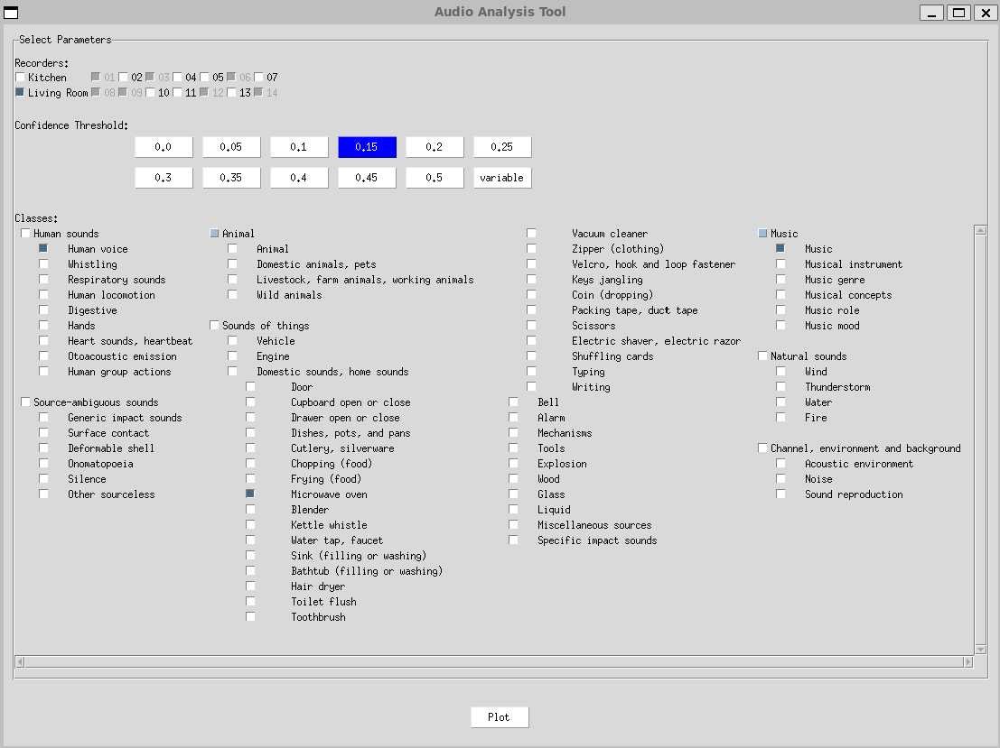
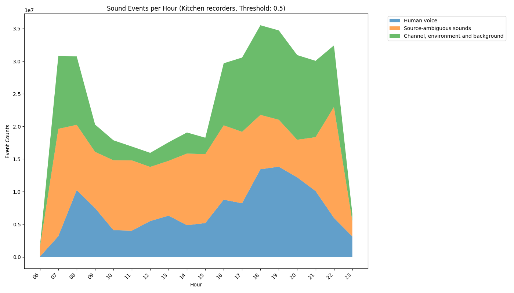
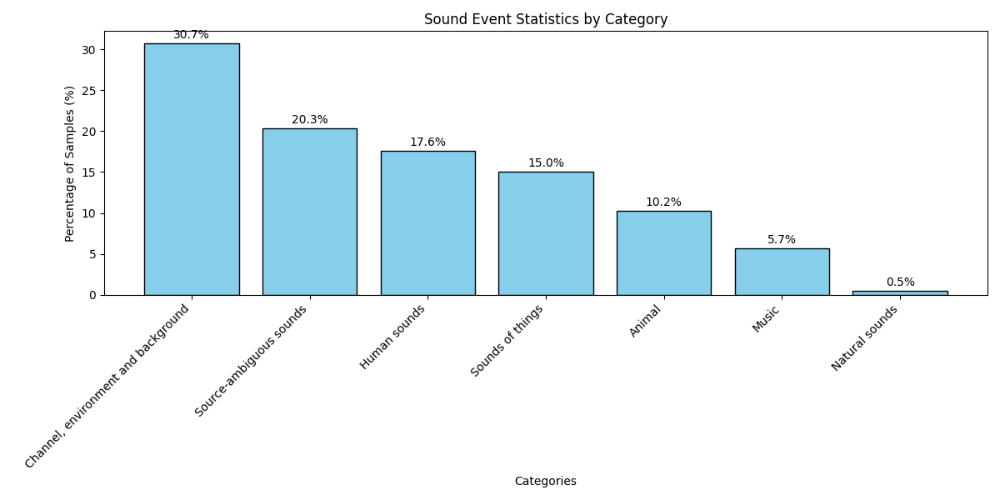

# Sounds of Home Analysis

This repository provides tools for analyzing and visualizing sound events detected by recorders from the [Sounds of Home Dataset](https://www.cvssp.org/data/ai4s/sounds_of_home/). The analysis framework leverages the hierarchical structure of the [AudioSet ontology](https://research.google.com/audioset/ontology/index.html), enabling systematic exploration and categorization of domestic soundscapes.

## Interactive Analysis Interface

The main analysis interface allows comprehensive exploration of the dataset:



Generated visualizations display sound event distributions:



### Installation and Setup

1. **Environment Requirements**:
  - Python 3.6 or higher
  - Git (for cloning the repository)

2. **Install Project**:
```bash
git clone https://github.com/gbibbo/sounds_of_home_analysis.git
cd sounds_of_home_analysis
pip install -e .
```

3. **Download Dataset**:

  - Visit the [Sounds of Home Dataset](https://www.cvssp.org/data/ai4s/sounds_of_home/) page
  - Download the prediction JSON files
  - Create a 'data' directory in the repository root:
```bash
mkdir data
```
  - Place downloaded JSON files in the 'data' directory

4. **Configure Data Path**:
  - Open `src/config.py`
  - Set `PREDICTIONS_ROOT_DIR = 'data'`

5. **Launch Interface**:
```bash
python scripts/main.py --gui
```

### Using the Interface

1. **Select Parameters**:
 - Confidence Threshold: Filter events by prediction confidence
 - Recorders: Select the recorders to be used for audio analysis. Note how the recorders were [originally installed](https://www.cvssp.org/data/ai4s/sounds_of_home/#:~:text=Recording%20Information)
 - Sound Classes: Select event types to analyze
 - Days: Specify analysis timeframe

2. **Generate Analysis**:
 - Click `Plot` for time series analysis, or `Plot and Analysis` for time series analysis, basic statistical analysis, correlation analysis, PCA, heatmaps and clustering, peak activity analysis
 - View graph showing event distribution
 - Results automatically save to `assets/images` directory

## Analysis Scripts

### Batch Analysis

The `batch_analysis.py` script performs analysis across multiple confidence thresholds:

1. **Threshold Options**:
- Fixed thresholds: [0.0, 0.05, 0.1, 0.15, 0.2, 0.25, 0.3, 0.35, 0.4, 0.45, 0.5]
- Variable threshold: Adapts based on [AudioSet label quality](https://research.google.com/audioset/download.html#quality:~:text=Quality%20Assessment%20and%20rerating)
  - Uses linear interpolation:
    ```python
    threshold = 0.2 + (0.5 - 0.2) * (label_quality / 100)
    ```
  - Example:
    - For 100% quality label: threshold = 0.5
    - For 50% quality label: threshold = 0.35
    - For 0% quality label: threshold = 0.2

2. **Usage**:
```bash
python scripts/batch_analysis.py
```

3. **Output Directory Structure**:
```bash
analysis_results/
└── batch_analysis_results/
    ├── analysis_results_threshold_0.0.json
    ├── analysis_results_threshold_0.05.json
    ...
    ├── analysis_results_threshold_0.5.json
    └── analysis_results_threshold_variable.json
```

4. **Customizing Analysis**:
 - Configure data selection in `src/config.py`:
   ```python
   SELECTED_RECORDERS = []  # Empty list means all recorders
   SELECTED_DAYS = []      # Empty list means all available days
   SELECTED_HOURS = []     # Empty list means all hours
  ```

### Granger Causality Analysis

The `granger.py` script analyzes temporal relationships between sound events:

1. **Analysis Features**:
- Time Series Analysis using ARIMA models
- Cross-Correlation Functions with Lag Analysis
- Granger Causality Tests
- Principal Component Analysis (PCA)
- UMAP and t-SNE visualizations
- Animated temporal evolution visualization

2. **Usage**:
```bash
python scripts/granger.py
```
3. **Output Directory Structure**:
```bash
granger/
├── figures/
│   ├── time_series.png
│   ├── correlation_matrix.png
│   ├── top_correlations.png
│   ├── pca_results.png
│   ├── umap_results.png
│   ├── tsne_results.png
│   ├── umap_frames/
│   └── umap_animation_custom.gif
├── results/
│   ├── significant_correlations.json
│   ├── granger_causality_results.json
│   └── umap_intermediate_data.pkl
└── logs/
    └── analysis_log_[timestamp].txt
```

### Minute-Level Analysis
The `generate_minute_data.py` script processes audio events with minute-level resolution:

1. **Features**:
- Aggregates detection counts across all recorders
- Applies quality-based confidence thresholds
- Processes individual AudioSet classes without ontology aggregation

2. **Usage**:
```bash
python scripts/generate_minute_data.py
```

3. **Output**:
```bash
analysis_results/
└── minute_analysis_results/
    └── minute_counts.json  # Minute-by-minute event counts
```

### Events Statistics
The `events_statistics.py` script generates comprehensive statistical information about sound event occurrences:
1. **Analysis Features**:
- Processes multiple JSON prediction files
- Handles hierarchical AudioSet relationships
- Applies confidence thresholds
- Generates category and subcategory statistics
- Creates visualization plots



2. **Usage**:
```bash
python scripts/events_statistics.py
```

3. **Output Directory Structure**:
```bash
analysis_results/
└── events_statistics_results/
    ├── events_statistics_results.json
    ├── main_categories.png          # Overall category distribution
    └── subcategories_*.png         # Detailed subcategory analysis
```
4. **Configuration Options**:

- Adjust in `src/config.py`:
  - `PREDICTIONS_ROOT_DIR`: Data location
  - `DEFAULT_CONFIDENCE_THRESHOLD`: Base threshold
  - `USE_LABEL_QUALITY_THRESHOLDS`: Enable/disable quality-based thresholds
  - `GENERATE_GRAPHS`: Control visualization output
  - `CUSTOM_CATEGORIES`: Define category structure

## Dynamic visualization

Here's a dynamic preview of the application interface that you can also find in the [dataset website](https://www.cvssp.org/data/ai4s/sounds_of_home/#:~:text=00%2C%2022%3A00-,SLOW,-MEDIUM)

.gif)

## Dataset

This project is designed to run with the dataset that can be downloaded from:

[Sounds of Home Dataset](https://www.cvssp.org/data/ai4s/sounds_of_home/)

Download the dataset and ensure the prediction files (JSON files) are located in the appropriate directory within the project, as specified in the configuration.

## Project Structure

```plaintext
.
├── analysis_results
│   ├── batch_analysis_results
│   │   └── analysis_results_threshold_*.json
│   └── events_statistics_results
│       ├── events_statistics_results.json
│       ├── main_categories.png
│       └── subcategories_*.png
├── assets
│   └── images
│       ├── interface.png
│       └── plot.png
├── metadata
│   ├── class_labels_indices.csv
│   └── ontology.json
├── README.md
├── requirements.txt
├── scripts
│   ├── batch_analysis.py
│   ├── events_statistics.py
│   ├── main.py
│   └── plot_results.py
├── setup.py
├── src
│   ├── config.py
│   ├── data_processing
│   │   ├── load_data.py
│   │   ├── process_data.py
│   │   └── utils.py
│   ├── gui
│   │   └── tkinter_interface.py
│   └── visualization
│       └── plot_data.py
└── tests
    └── test_data_processing.py
```

**Note**: The directories and files excluded by `.gitignore` (such as sample data and analysis results) are not shown in the project structure.

## Contributing

Contributions are welcome. To contribute:

1. Fork the repository.

2. Create your feature branch:

```bash
git checkout -b feature/new-feature
```

3. Commit your changes:

```bash
git commit -m 'Add new feature'
```

4. Push to the branch:

```bash
git push origin feature/new-feature
```

5. Open a Pull Request on GitHub.

## License

This project is licensed under the MIT License. See the LICENSE file for details.

## Contact

For questions or support, you can reach me through:

- GitHub: gbibbo
- Email: g.bibbo@surrey.ac.uk
