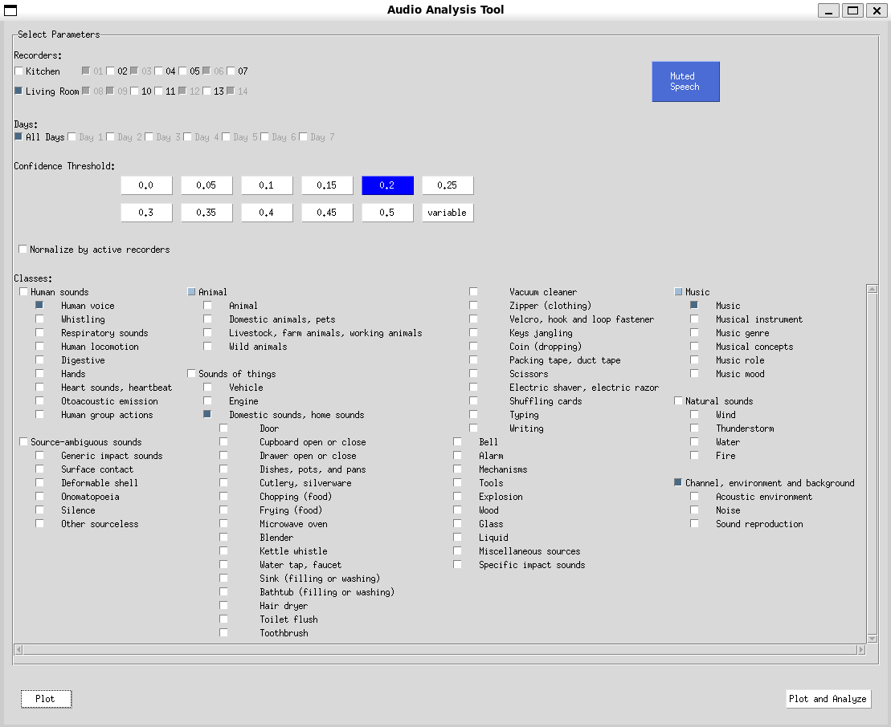

# Sounds of Home Analysis

This repository contains tools to visualize sound events detected by recorders used in the "Sounds of Home" experiment. The goal is to provide a user-friendly interface that respects the [AudioSet ontology](https://research.google.com/audioset/ontology/index.html), allowing users to explore and analyze data in a structured and understandable way.

## Description

The project is designed to process and visualize sound events detected in the data collected by the experiment's recorders. It uses the [AudioSet ontology](https://research.google.com/audioset/ontology/index.html) to organize and categorize sounds, facilitating the analysis and understanding of acoustic data.

## Interface Preview

Here's a preview of the application interface:



The interface allows you to select different parameters and visualize the results like this:


## Features

- **User Interface (GUI) with Tkinter**: Allows selection of parameters such as recorders, sound classes, days, and hours to customize the analysis.
- **Batch Analysis Script**: Perform analyses over all data without opening the GUI, useful for processing large datasets efficiently.
- **Multiprocessing Support**: Utilizes multiple CPU cores to process large datasets quickly.
- **Customizable Visualization**: Generates graphs showing the distribution of sound events by hour, including the selected confidence threshold.
- **AudioSet Ontology Compatibility**: Respects the hierarchy and categories defined in the ontology to organize sound events.

## Requirements

- Python 3.6 or higher
- Python libraries:
  - `tkinter`
  - `matplotlib`
  - `numpy`
  - `tqdm`
- Access to the "Sounds of Home" experiment dataset

## Installation

1. **Clone the repository**:

```bash
git clone https://github.com/gbibbo/sounds_of_home_analysis.git
cd sounds_of_home_analysis
```

2. **Install dependencies**:

```bash
pip install -r requirements.txt
```

**Note**: Make sure your Python environment is properly configured. Using a virtual environment is recommended.

## Dataset

This project is designed to run with the dataset that can be downloaded from:

[Sounds of Home Dataset](https://www.cvssp.org/data/ai4s/sounds_of_home/)

Download the dataset and ensure the prediction files (JSON files) are located in the appropriate directory within the project, as specified in the configuration.

## Project Structure

```plaintext
.
├── README.md
├── assets/
│   ├── images/
│   │   ├── interface.png
│   │   └── plot.png
│   └── sample_data/
├── metadata/
│   ├── class_labels_indices.csv
│   └── ontology.json
├── requirements.txt
├── setup.py
├── src/
│   ├── __init__.py
│   ├── batch_analysis.py     # New script for batch analysis
│   ├── config.py             # Configuration file with global variables
│   ├── data_processing/
│   │   ├── __init__.py
│   │   ├── load_data.py
│   │   ├── process_data.py
│   │   └── utils.py
│   ├── gui/
│   │   ├── __init__.py
│   │   └── tkinter_interface.py
│   ├── main.py               # Application entry point
│   ├── plot_results.py       # New script for plotting results
│   ├── visualization/
│   │   ├── __init__.py
│   │   └── plot_data.py
├── tests/
│   ├── __init__.py
│   └── test_data_processing.py
```

**Note**: The directories and files excluded by `.gitignore` (such as sample data and analysis results) are not shown in the project structure.

## Usage

### Configure the Predictions Directory

In the `src/config.py` file, set the path to the directory containing the JSON prediction files you downloaded:

```python
PREDICTIONS_ROOT_DIR = 'path/to/predictions'
```

### Run the Graphical Interface

Execute the `main.py` file to start the graphical interface:

```bash
python src/main.py --gui
```

### Select Parameters in the Interface

- **Confidence Threshold**: Set the minimum confidence threshold for considering a valid prediction.
- **Recorders**: Select the recorders whose data you want to analyze.
- **Classes and Subclasses**: Select the sound categories of interest from the predefined CUSTOM_CATEGORIES.
- **Days and Hours**: Select specific days and hours for analysis.

### Run the Analysis

Click the "Run Analysis" button to process the data and generate the visualization.

### View Results

A graph will be displayed representing the percentage of sound events per hour, according to the selected parameters.

## Run Batch Analysis without GUI

A new script `batch_analysis.py` has been added to perform batch analyses over all data without opening the GUI. This is particularly useful for processing large datasets efficiently.

### Steps to Run Batch Analysis

1. **Ensure the Dataset is Configured**: Make sure that `PREDICTIONS_ROOT_DIR` in `src/config.py` points to the directory containing your dataset.

2. **Run the Batch Analysis Script**:

```bash
python src/batch_analysis.py
```

### What to Expect

- The script will perform analysis for multiple confidence thresholds: 0.0, 0.1, 0.2, 0.3, 0.4, and 0.5.
- It uses multiprocessing to speed up data processing on large datasets.
- The analysis results will be saved in the `analysis_results` directory, with each file named to include the threshold value (e.g., `analysis_results_threshold_0.2.json`).
- Inside each JSON file, the threshold value and the analysis data (`data_counts`) are recorded.

## Generate Plots from Analysis Results

A new script `plot_results.py` has been added to generate plots using the results from the batch analysis.

### Steps to Generate Plots

1. **Ensure Analysis Results Exist**: Run `batch_analysis.py` to generate the analysis results if you haven't already.

2. **Specify Classes and Threshold in `plot_results.py`**:

At the beginning of `src/plot_results.py`, you can specify the classes you want to plot and the threshold value:

```python
# Classes to plot
classes_to_plot = [
    'Channel, environment and background',
    'Acoustic environment',
    'Noise',
    'Sound reproduction'
]

# Threshold to use
threshold = 0.2
```

3. **Run the Plotting Script**:

```bash
python src/plot_results.py
```

### What to Expect

- The script will read the analysis results from the specified JSON file in the `analysis_results` directory.
- It will generate a bar chart showing the event counts for the specified classes across different hours.
- The plot will be displayed using matplotlib.

### Customizing the Plot

- **Change Classes**: Modify the `classes_to_plot` list to include the classes you're interested in.
- **Change Threshold**: Set the `threshold` variable to match the threshold of the analysis results you want to use.
- **Ensure Data Availability**: Make sure that the analysis results for the specified threshold exist.

## Customization

### Custom Categories Configuration

You can modify or add categories in the `src/config.py` file, where the `CUSTOM_CATEGORIES` dictionary is defined to adapt the analysis to your needs. This affects both the GUI and the batch analysis scripts.

### AudioSet Ontology

The project uses the AudioSet ontology to organize sounds. Ensure that ontology files and class mapping are correctly referenced in the code.

## Contributing

Contributions are welcome. To contribute:

1. Fork the repository.

2. Create your feature branch:

```bash
git checkout -b feature/new-feature
```

3. Commit your changes:

```bash
git commit -m 'Add new feature'
```

4. Push to the branch:

```bash
git push origin feature/new-feature
```

5. Open a Pull Request on GitHub.

## License

This project is licensed under the MIT License. See the LICENSE file for details.

## Contact

For questions or support, you can reach me through:

- GitHub: gbibbo
- Email: g.bibbo@surrey.ac.uk