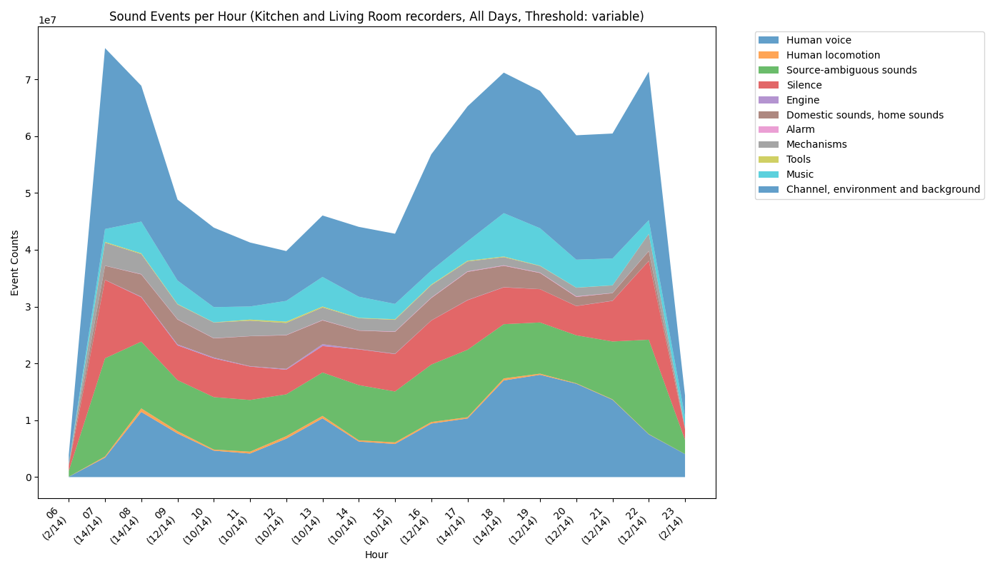

# Sounds of Home Analysis

This repository contains tools to visualize sound events detected by recorders used in the "Sounds of Home" experiment. The goal is to provide a user-friendly interface that respects the [AudioSet ontology](https://research.google.com/audioset/ontology/index.html), allowing users to explore and analyze data in a structured and understandable way.

## Description

The project is designed to process and visualize sound events detected in the data collected by the experiment's recorders. It uses the [AudioSet ontology](https://research.google.com/audioset/ontology/index.html) to organize and categorize sounds, facilitating the analysis and understanding of acoustic data.

## Interface Preview

Here's a preview of the application interface:


The interface allows you to select different parameters and visualize the results like this:



## Features

- **User Interface (GUI) with Tkinter**: Allows selection of parameters such as recorders, sound classes, days, and hours to customize the analysis
- **Efficient Data Processing**: Loads and processes JSON prediction files optimally using threads
- **Customizable Visualization**: Generates graphs showing the distribution of sound events by hour, including the selected confidence threshold
- **AudioSet Ontology Compatibility**: Respects the hierarchy and categories defined in the ontology to organize sound events

## Requirements

- Python 3.6 or higher
- Python libraries:
  - tkinter
  - matplotlib
  - numpy
  - tqdm
- Access to the "Sounds of Home" experiment dataset

## Installation

1. Clone the repository:

    ```bash
    git clone https://github.com/gbibbo/sounds_of_home_analysis.git
    cd sounds_of_home_analysis
    ```

2. Install dependencies:

    ```bash
    pip install -r requirements.txt
    ```

**Note**: Make sure your Python environment is properly configured. Using a virtual environment is recommended.

## Dataset

This project is designed to run with the dataset that can be downloaded from:

[Sounds of Home Dataset](https://www.cvssp.org/data/ai4s/sounds_of_home/)

Download the dataset and ensure the prediction files (JSON files) are located in the appropriate directory within the project, as specified in the configuration.

## Project Structure

    ```
    .
    ├── assets/
    │   └── images/
    │       ├── interface.png
    │       └── plot.png
    ├── metadata/
    │   ├── class_labels_indices.csv
    │   └── ontology.json
    ├── scripts/
    ├── src/
    │    ├── config.py              # Configuration file with global variables
    │    ├── main.py                # Application entry point
    │    ├── data_processing/       # Data loading and processing modules
    │    │   ├── __init__.py
    │    │   ├── load_data.py
    │    │   ├── process_data.py
    │    │   └── utils.py
    │    ├── gui/                   # GUI-related modules
    │    │   ├── __init__.py
    │    │   └── tkinter_interface.py
    │    ├── visualization/         # Graph generation modules
    │    │   ├── __init__.py
    │    │   └── plot_data.py
    │    └── tests/                # Unit and integration tests
    ├── requirements.txt              # Project dependencies
    └── README.md                     # This file
    ```

## Usage

### Configure the Predictions Directory

In the `src/config.py` file, set the path to the directory containing the JSON prediction files:

    ```
    PREDICTIONS_ROOT_DIR = 'path/to/predictions'
    ```

### Run the Application

Execute the main.py file to start the graphical interface:

    ```
    python scripts/src/main.py
    ```

### Select Parameters in the Interface

1. **Confidence Threshold**: Set the minimum confidence threshold for considering a valid prediction
2. **Recorders**: Select the recorders whose data you want to analyze
3. **Classes and Subclasses**: Select the sound categories of interest
4. **Days and Hours**: Select specific days and hours for analysis

### Run the Analysis

Click the "Run Analysis" button to process the data and generate the visualization.

### View Results

A graph will be displayed representing the percentage of sound events per hour, according to the selected parameters.

## Customization

### Custom Categories Configuration

You can modify or add categories in the `src/config.py` file, where the `CUSTOM_CATEGORIES` dictionary is defined to adapt the analysis to your needs.

### AudioSet Ontology

The project uses the [AudioSet ontology](https://research.google.com/audioset/ontology/index.html) to organize sounds. Ensure that ontology files and class mapping are correctly referenced in the code.

## Contributing

Contributions are welcome. To contribute:

1. Fork the repository
2. Create your feature branch (`git checkout -b feature/new-feature`)
3. Commit your changes (`git commit -m 'Add new feature'`)
4. Push to the branch (`git push origin feature/new-feature`)
5. Open a Pull Request on GitHub

## License

This project is licensed under the MIT License. See the LICENSE file for details.

## Contact

For questions or support, you can reach me through:

- GitHub: gbibbo
- Email: g.bibbo@surrey.ac.uk